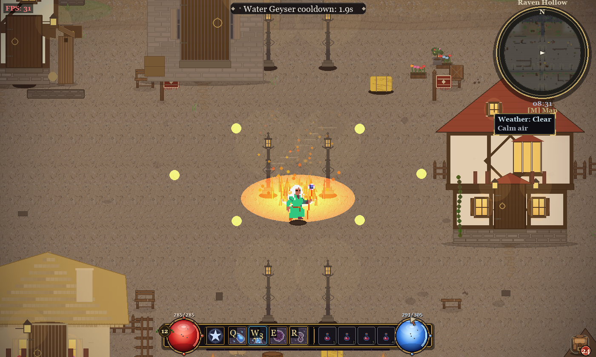
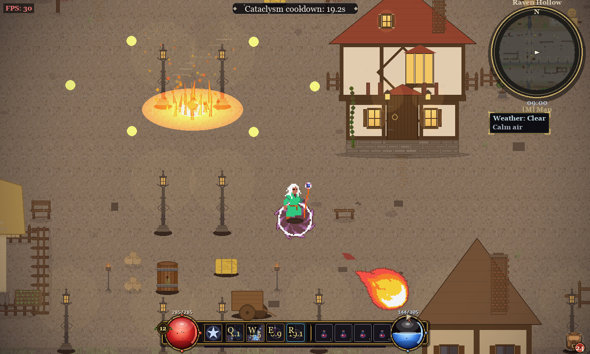
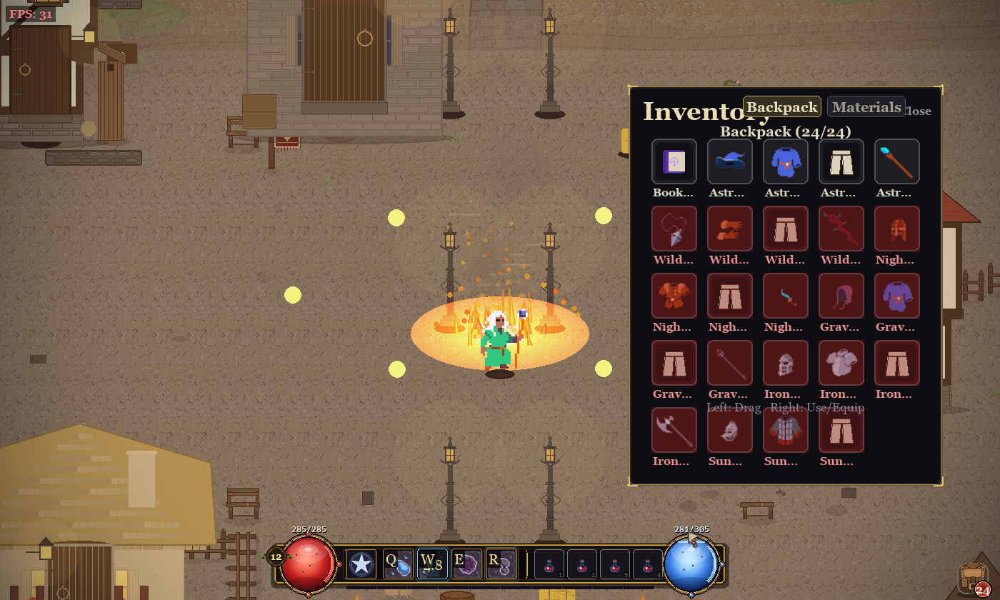
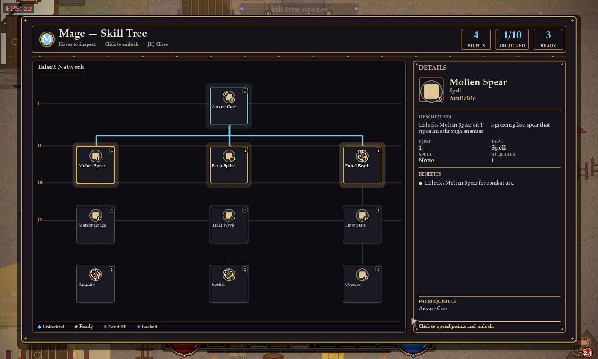
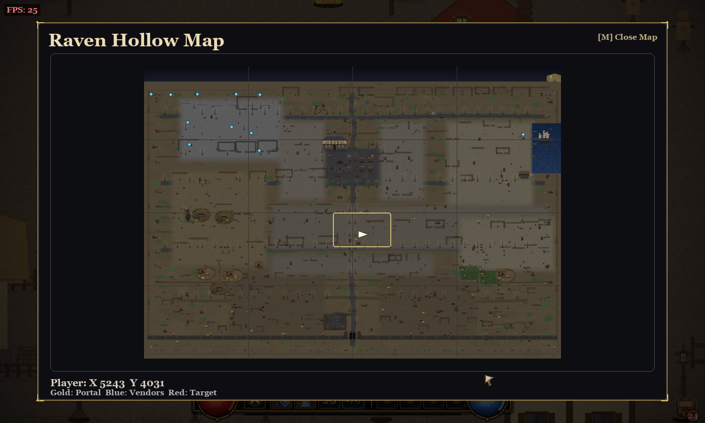

# ⚔️ Sângeroasă

**A medieval-fantasy action RPG built in Python & pygame.**

Pick a class, master a real-time spell & talent system, and explore the living town of *Raven Hollow* —
its shops, farms, and the monster-haunted wilderness beyond.



---

## About

**Sângeroasă** is a single-player, top-down action RPG. You arrive a stranger in the town of
**Raven Hollow**, choose one of six classes, and grow from a level-1 nobody into a hero by completing
quests, crafting gear, and battling the creatures lurking in the wilds and the frozen north.

The whole game — rendering, audio, combat, world generation, UI — is hand-built in Python on top of
**pygame**, with procedurally generated buildings, props, and sound effects.

## Features

- **6 playable classes** — Mage, Rogue, Ranger, Necromancer, Warrior, Paladin — each with unique
  spells, passives, stats, and a class-specific **ultimate**.
- **Real-time combat** — an 8-slot spell bar, basic attacks, status effects, summons, and a deep
  per-class **talent / skill tree**.
- **A living town** — a dozen scattered shops with patrolling vendors, plus town hall, windmill,
  church, gladiator arena, harbour and docks.
- **Farms & wildlife** — animated coops/pens with wandering, flocking animals; passive deer, birds and rats.
- **Three biomes** — town, monster-filled **wilderness**, and a frozen **ice biome**.
- **Quests & professions** — a branching quest line plus alchemy, blacksmithing and runecrafting.
- **Atmosphere** — day/night cycle, dynamic weather, particle VFX, and a procedural audio engine.
- **An ornate fantasy UI** — gold-bezel HUD, gem HP/MP orbs, minimap, world map, inventory and more.

## Screenshots

| Combat & spells | Inventory & gear |
|---|---|
|  |  |

| Talent / skill tree | World map |
|---|---|
|  |  |

## Controls

| Action | Keys |
|---|---|
| Move | `W` `A` `S` `D` |
| Aim / basic attack | Mouse + **Left click** |
| Cast spells | `Q` `W` `E` `R` `T` `1` `2` `3` |
| Ultimate | `4` |
| Inventory / Character / Skills / Map | `I` / `C` / `K` / `M` |
| Close | `Esc` |

## Get the game

```bash
git clone https://github.com/<your-username>/sangeroasa.git
cd sangeroasa
python -m pip install -r requirements.txt
python main.py
```

Built with pure **Python 3.12 + pygame 2.6** — no game engine. See the
[repository](https://github.com/<your-username>/sangeroasa) for source and full documentation.
